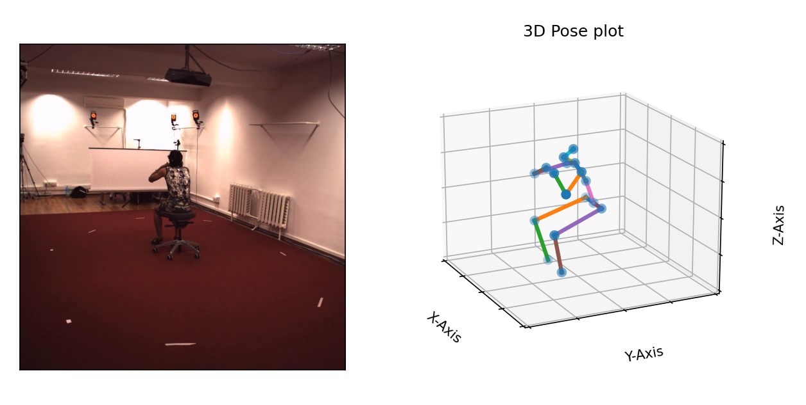
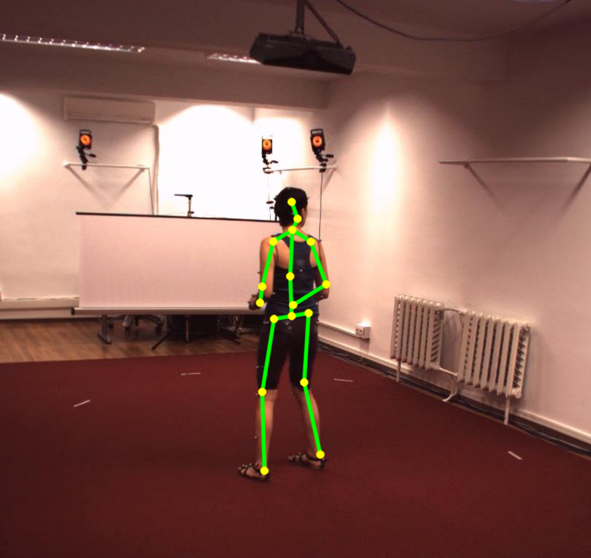
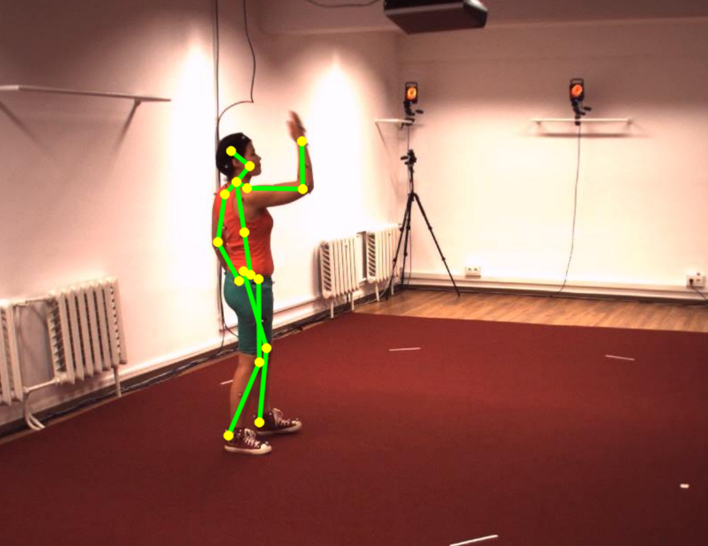

# Human3.6M - Dataset processing and visualization
A library for processing and generating readable annotations for Human3.6M dataset.

## Steps
### 1. Extract all dataset files
```
|-compressed
|----annotations.zip
|----s_01_act_02_subact_01_ca_01.zip
|----s_01_act_02_subact_01_ca_02.zip
|----s_01_act_02_subact_01_ca_03.zip
|----s_01_act_02_subact_01_ca_04.zip
|----...
```

```
python extract_all.py
```
First put all dataset ZIP files in to directory "compressed". The files will be extracted to folder "extracted"

### 2. Generate annotations
```
python extract_annotations.py
```
```
subject1_annotations.json
subject5_annotations.json
subject6_annotations.json
subject7_annotations.json
subject8_annotations.json
subject9_annotations.json
subject10_annotations.json
subject11_annotations.json
```

The annotations will be generated for each subject as json file in "extracted" folder.

To download GENERATED JSON files please email at ali.manjotho.ali@gmail.com.

## 3D Pose Visualization
To visualize a pose in 3D
```
python visualize_3d.py
```



## 2D Pose Visualization
To visualize a pose in 2D
```
python visualize_2d.py
```
 

