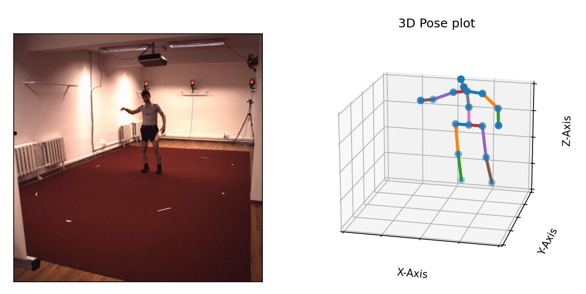

# Human3.6M - Dataset processing and visualization
A library for processing and generating readable annotations for Human3.6M dataset.

## Steps
### 1. Extract all dataset files
```
python extract_all.py
```

### 2. Generate annotations
```
python extract_annotations.py
```


## 3D Pose Visualization
To visualize a pose in 3D
```
python visualize_3d.py
```



## 2D Pose Visualization
 

